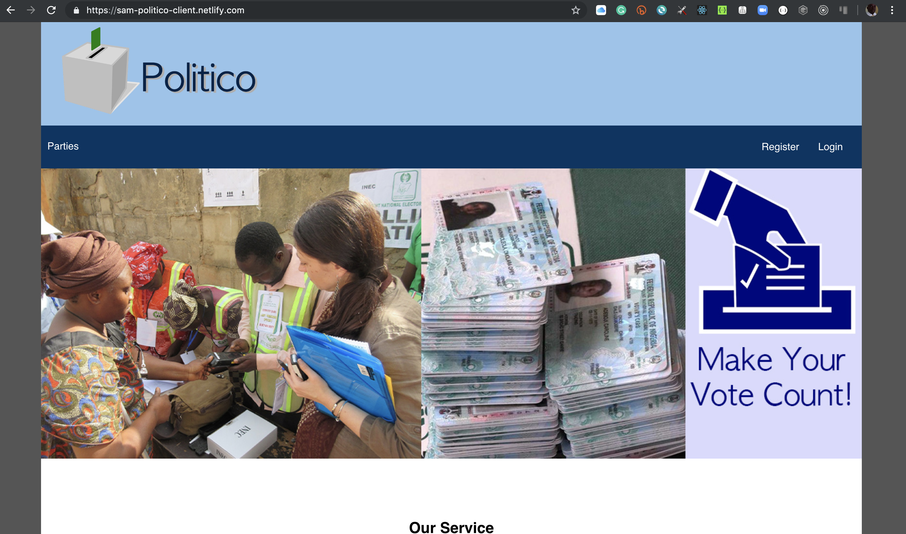

# Politico

# Description
Politico is a platform that enables citizens give their mandate to politicians running for different government offices while building trust in the process through transparency.

   

## Table of Contents

- [Introduction](#introduction)
- [Installing](#installing)
- [Working Routes](#working-routes)
- [License](#license)
- [Acknowledgments](#acknowledgments)
- [Contribution](#contribution)
- [Live Demo](#live-demo)

# Introduction

## _Project Overview_

This project enables E-voting system

<b> Test API Endpoints Here: </b> https://sam-politico.herokuapp.com/  
<b> Pivotal Tracker: </b>https://www.pivotaltracker.com/n/projects/2330156 
<b> Hosted application: </b>https://sam-politico-client.netlify.com/ 

### **Style guide**

[Airbnb ](https://github.com/airbnb/javascript)(Javascript style guide)

## Screenshoot(UI template)

## Required Features

1. `Users can sign up`.
2. `Users can login`.
3. `Admin (electoral body) can create political parties`.
4. `Admin (electoral body) can delete a political party`.
5. `Admin (electoral body) can create different political offices`.
6. `Users can vote for only one politician per political office`.
7. `Users can see the results of election`.

# Installing

#### _Prerequisites_

Ensure you have **NodeJS** installed by entering `node -v` on your terminal
If you don't have **NodeJS** installed go to the [NodeJS Website](http://nodejs.org), and follow the download instructions

To install this app

`git clone https://github.com/walsamlee/politico-client`

And install the required dependencies

`npm install`

Run server

`npm start`

## Running the tests

To run test cases

`npm test`

# Working Routes

## _API Endpoints_

| Endpoint             |                   Functionality                   | HTTP method |
| -------------------- | :-----------------------------------------------: | ----------: |
| /api/v1/auth/signup  |               Create a user account               |        POST |
| /api/v1/auth/login   |                   Login a user                    |        POST |
| /api/vi/office/run   | User can declare an interest to run for an office |        POST |
| /api/vi/candidates   |      User can get all interested candidates       |         GET |
| /api/vi/offices      |         User can get all political office         |         GET |
| /api/vi/parties      |        User can get all political parties         |         GET |
| /api/vi/parties      |        Admin can create a political party         |        POST |
| /api/vi/offices      |        Admin can create a politcal offices        |        POST |

## License

This projects is under the ISC LICENSE

## Acknowledgments

- [Andela](http://andela.com)
- [Victoria Offoma (Learning Facilitator)](victoria.offoma@andela.com)
- [Stackoverflow](stackoverflow.com)

## Contribution

_If you want to contribute to this project:_

- `Fork it! :fork_and_knife:`
- `Create your feature branch: git checkout -b my-new-feature`
- `Commit your changes: git commit -m 'Add some feature'`
- `Push to the branch: git push origin my-new-feature`
- `Create a pull request.`
